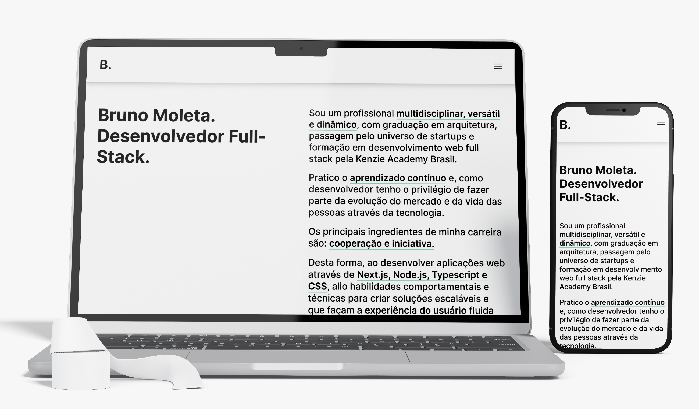
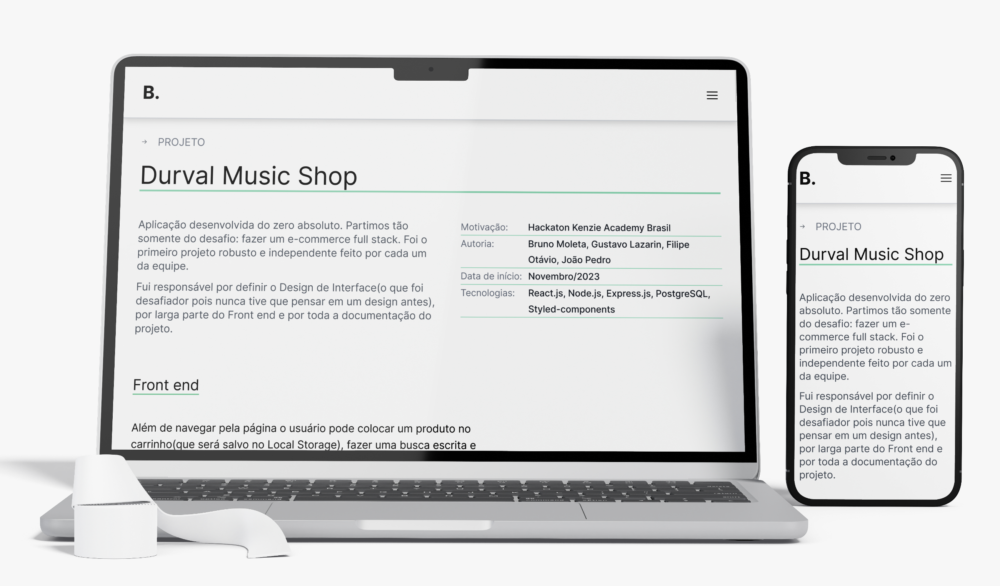

# Personal Portfolio

<hr style="border-top: 3px solid #bbb;">

## Description

Personal developer portfolio built only on the front end with Next.js.
The goal is to display and give a through explanation of what was learned and 
to share knowledge with the site visitor acting as a tour guid for them.

<hr style="border-top: 3px solid #bbb;">

## Table of contents

- [Overview](#overview)
    - [Built with](#built-with)
      - [Javascript related](#javascript-related)
      - [Other technologies](#other-technologies)
    - [Design](#design)
        - [Homepage](#homepage)
        - [Project page](#project-page)
    - [Deploy link](#deploy-link)
- [Project Structure](#project-structure)
  - [Scripts](#scripts) 
  - [Dependencies](#dependencies) 
  - [Dev dependencies](#dev-dependencies) 
  - [Architecture](#architecture)
- [The process](#the-process)
    - [Lessons learned](#lessons-learned)
    - [Continued development](#continued-development)
    - [Useful resources](#useful-resources)
- [Acknowledgments](#acknowledgments)
    - [Author](#author)

<hr style="border-top: 3px solid #bbb;">

## Overview


### Built with

#### Javascript related
- Next.js
- Typescript

#### Other technologies
- Styled-components
- Radix UI
- Aria Kit


### Design


#### Homepage

There's four sections;
- About me;
- Illustrations made by Sarah Fossheim using only CSS and HTML;
- Tech Stacks Bruno uses;
- Projects;
- Contact;
  



#### Project page

The project page was designed by Bruno.
It tours the user through the fullstack project.
It's separated in the following parts:
- Info about the project;
- Introductory text of why it was developed;
- Front end including:
    - screenshots;
    - notes on the React components;
- Back end including:
    - Relationships table;
    - Code snippets;
    - Swagger documentation;




### Deploy link

- Frontend deploy: [https://brunomoleta.com.br/](https://brunomoleta.com.br)

<hr style="border-top: 3px solid #bbb;">

## Project structure

### Scripts

dev: Starts the development environment.
build: Used to build the application for production.
Executes ESLint for linting and automatic correction.
Execute the scripts with npm run, yarn or pnpm.

- `dev`: Starts the development environment.
- `build`: Used to build the application for production.
- `lint`: Executes ESLint for linting and automatic correction.

Run the scripts with `npm run`, `yarn` or `pnpm`.

### Dependencies

- ``@ariakit/react``: ^0.4.2,
- ``@radix-ui/react-accordion``: ^1.1.2,
- ``@radix-ui/react-dropdown-menu``: ^2.0.6,
- ``@radix-ui/react-icons``: ^1.3.0,
- ``devicon``: ^2.16.0,
- ``framer-motion``: ^11.0.8,
- ``next``: 14.1.3,
- ``react``: ^18,
- ``react-dom``: ^18,
- ``react-toastify``: ^10.0.4,
- ``styled-components``: ^6.1.8

### Dev dependencies

- ``@types/node``: ^20,
- ``@types/react``: ^18,
- ``@types/react-dom``: ^18,
- ``babel-plugin-styled-components``: ^2.1.4,
- ``eslint``: ^8,
- ``eslint-config-next``: 14.1.0,
- ``new-component``: ^5.0.2,
- ``prettier``: ^3.2.5,
- ``typescript``: ^5"

### Architecture

```
portfolio/
│
├── node_modules/         Dependencies installed in the local environment.
│
├── public/               Public files.
│
├── lib/                  Includes a file to set up Styled-components.
│
├── src/                  Source code
│   ├── app/              Routes of the project;
│   ├── assets/           Static resources such as images, logos and illustrations;
│   ├── components/       React components;
│   ├── providers/        Setting Styled-components Global styles at the root;
│   ├── services/         Data related to the projects and helper functions.
│   ├── styles/           Styled-components components;
│   ├── types/            Component types;
│   └── ...
```
<hr style="border-top: 3px solid #bbb;">

## The process


### Lessons learned

- It was challenging and amusing to make an explanation of the two most
  interesting projects Bruno was involved in thus far.
  It feels like writing and explaining code are two
  separate skill sets. For guidance, I applied the method from Josh Cameau's ebook `Building an effective dev portfolio`,
  where we guide the user step by step, so they understand your project almost effortlessly.


- Technically speaking, the key components are the following:

Each page is simple:
````tsx
export default function EasyBankInvestments() {
    return (
        <SingleProject>
            <SProjSection project={projects[1]}/>
        </SingleProject>
    );
}
````

The SingleProject section has `header`, `back end` and `front end` sections:

````tsx
function SProjSection({project}: { project: IProject }) {
    return (
        <Wrapper>
            <SingleProjHeader project={project}/>{" "}
            <SingleProjTour isFront={true} project={project}/>
            <SingleProjTour isFront={false} project={project}/>
        </Wrapper>
    );
}
````

and the SingleProjTour renders each `argument` of the tour:
````tsx
function SingleProjTour({
  project,
  isFront = true,
}: {
  project: IProject;
  isFront?: boolean;
}) {
  const { frontImages, backImages } = project;

  const mapFront = frontImages.map((item, index) => (
    <TourPiece key={index}>
      <FrontImage content={item} />
    </TourPiece>
  ));
  const mapBack = backImages.map((item, index) => (
    <TourPiece key={index}>
      <BackEndCode content={item} />
    </TourPiece>
  ));

  return (
    <TourSection>
      <SubName>{isFront ? "Front end" : "Back end"}</SubName>
      {isFront ? mapFront : mapBack}
      <Span />
      <ProjectLinks isFront={isFront} project={project} />
    </TourSection>
  );
}
````

Each `TourPiece` rendered by ``mapFront`` and ``mapBack`` have:
- an explanatory paragraph;
- an image of the app running or a piece of `code` or `iframe`;
- the description of the `image`;

### Continued development

- Make an English version using state for international users;

### Useful resources

- [Josh Cameau's blog](https://www.joshwcomeau.com/) - The best frontend blog I know by far.
Here he offers the e-book for helping you develop a dev portfolio for free;
- [Radix UI](https://www.radix-ui.com/) - It saved me time from developing components such as the Dropdown;

<hr style="border-top: 3px solid #bbb;">

## Acknowledgments

- [Sarah Fossheim css art](https://codepen.io/collection/nwzQJq) - They do great art using CSS. This link takes you to all their work;

### Author

- Github - [Bruno Moleta](https://github.com/brunomoleta)
- Frontend Mentor - [@brunomoleta](https://www.frontendmentor.io/profile/brunomoleta)
- LinkedIn - [@brunomoleta](https://www.linkedin.com/in/bruno-moleta-santos/)
- Email - brunomoleta@pm.me

<hr style="border-top: 3px solid #bbb;">
